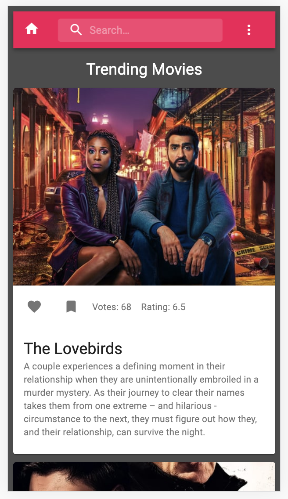
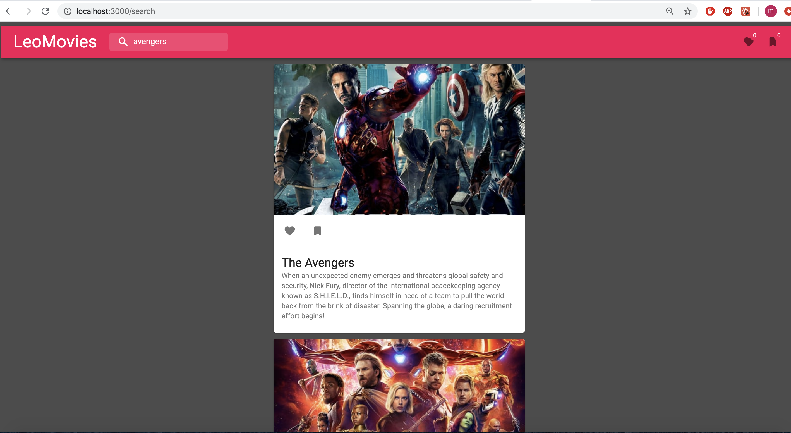
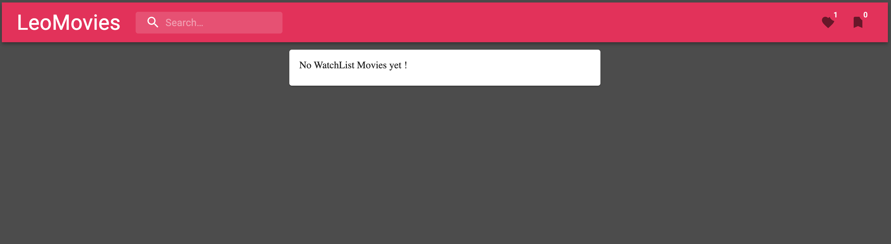

# LeoMovies

LeoMovies is an app where you can search movies, mark your favourite movies from results as well as add movies to watchlist. Supports both mobile and desktop.
- The Home page displays Trending movies.
- Search box helps to search movies with movie names.
- Each movie from search and home contains favourites and watchlist buttons.
- By clicking those buttons you can add and remove movies from list.
- You can check Favorite and watch list from App bar icons.
- You can also remove your list items in list also.

### Demo

- Mobile Home display

- Marking your Favourites and WatchList

- Search Results 

- WatchList page display message if zero items

- Your favourite movie list

### For Developers

- `git clone https://github.com/manasarjun/leo-movies.git`

- `cd leo-movies`
- `npm i` 
- `npm start`